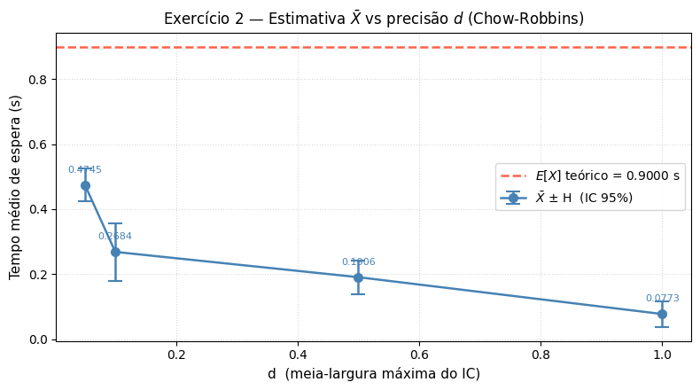
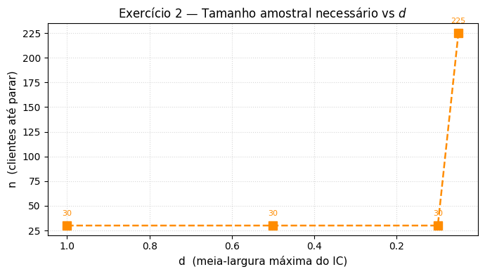
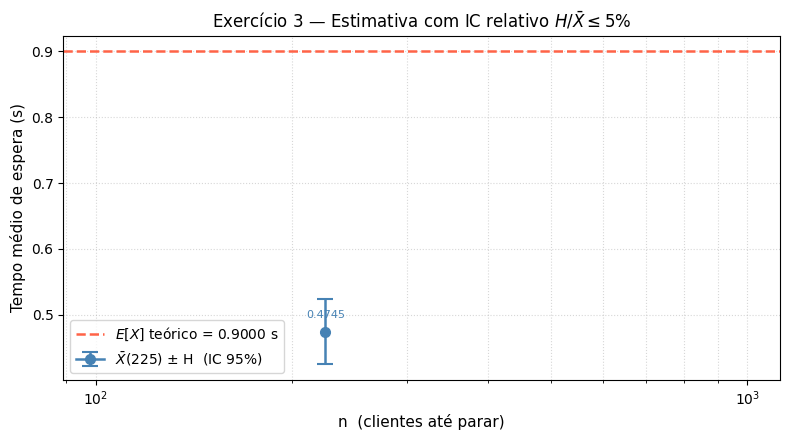

# Relatório — Simulação de Fila M/M/1

**ICC305 — Avaliação de Desempenho**  
**Carolina Maycá, Luiza Caxeixa e Nicolas Mady**

Prof. Edjair Mota, Dr.-Ing. — Instituto de Computação / UFAM

---

## Parâmetros do Sistema

| Parâmetro          | Valor         |
| ------------------ | ------------- |
| Taxa de chegada λ  | 9 clientes/s  |
| Taxa de serviço μ  | 10 clientes/s |
| Carga ρ = λ/μ      | 0,9 (90%)     |
| Valor teórico E[X] | **0,9 s**     |

A fórmula analítica da Teoria das Filas para o tempo médio de espera na fila M/M/1 é:

$$E[X] = \rho \cdot \frac{1/\mu}{1 - \rho}, \quad \text{onde } \rho = \frac{\lambda}{\mu}$$

Com λ = 9 e μ = 10, temos ρ = 0,9 e portanto **E[X] = 0,9 s**.

---

## Implementação

A simulação foi desenvolvida no notebook `mm1.ipynb`, organizado em células Python. A estrutura principal compreende:

- **Parâmetros e valor teórico:** definição de `LAM = 9.0`, `MU = 10.0`, `Z95 = 1.96` e a função `theoretical_mean()` que calcula E[X].
- **`OnlineStats`:** classe que acumula contagem, média e variância de forma incremental usando o algoritmo **online de Welford (forma paralela por lotes)**, sem guardar observações individuais — essencial para n = 10⁹.
- **`_lindley_loop`:** aplica a **recursão de Lindley** `W[i] = max(0, se_anterior − chegada[i])` para calcular o tempo de espera de cada cliente de forma sequencial.
- **`MM1Queue`:** classe principal com métodos `run_fixed`, `run_chow_robbins` e `run_relative_ci`, cada um correspondendo a um exercício.

A geração das variáveis aleatórias exponenciais segue a **Transformada Inversa**:

$$T_c = -\frac{1}{\lambda} \ln(1 - U), \quad T_s = -\frac{1}{\mu} \ln(1 - U), \quad U \sim \mathcal{U}[0,1]$$

As chegadas e os tempos de serviço são gerados em lotes com `numpy` (`rng.exponential`) e depois processados pelo laço de Lindley.

### Implementação da classe MM1

```python
class MM1Queue:
    def __init__(self, lam=LAM, mu=MU, seed=None):
        self.lam = lam
        self.mu  = mu
        self.rng = np.random.default_rng(seed)
        self._reset()

    def _reset(self):
        self._se   = 0.0
        self._t    = 0.0
        self.stats = OnlineStats()

    def _step(self, size):
        ia = self.rng.exponential(1.0 / self.lam, size).tolist()
        st = self.rng.exponential(1.0 / self.mu,  size).tolist()
        waiting, self._se, self._t = _lindley_loop(ia, st, self._se, self._t)
        self.stats.add_batch(np.array(waiting, dtype=np.float64))

    # Exercício 1
    def run_fixed(self, n):
        """Simula exatamente n clientes. Retorna (média, H)."""
        self._reset()
        done = 0
        while done < n:
            self._step(min(BATCH_SIZE, n - done))
            done = self.stats.n
        return self.stats.mean, self.stats.half_width

    # Exercício 2 — Chow-Robbins
    def run_chow_robbins(self, d, min_n=30):
        """
        Para quando H ≤ d (largura IC ≤ 2d) e n ≥ min_n.
        min_n evita parada espúria com variância degenerada em amostras tiny.
        Retorna (n, média, H).
        """
        self._reset()
        while True:
            self._step(1)
            if self.stats.n >= min_n and self.stats.half_width <= d:
                break
        return self.stats.n, self.stats.mean, self.stats.half_width

    # Exercício 3 — IC relativo
    def run_relative_ci(self, gamma=0.05, min_n=30):
        """
        Para quando H / X̄ ≤ γ e n ≥ min_n.
        Retorna (n, média, H).
        """
        self._reset()
        while True:
            self._step(1)
            s = self.stats
            if s.n >= min_n and s.mean > 0 and s.half_width / s.mean <= gamma:
                break
        return self.stats.n, self.stats.mean, self.stats.half_width
```
---

## Exercício 1 — Simulação com n Fixo

### Descrição

O objetivo é executar a simulação da fila M/M/1 para quatro valores de n — 10³, 10⁵, 10⁷ e 10⁹ — com λ = 9 e μ = 10. Para cada n, calcula-se o tempo médio de espera na fila $\bar{X}(n)$, o intervalo de confiança de 95% e o erro absoluto em relação ao valor teórico E[X].

O intervalo de confiança é calculado como:

$$\bar{X}(n) \pm H, \quad H = z_{0,975} \cdot \frac{s}{\sqrt{n}} \approx 1{,}96 \cdot \frac{s}{\sqrt{n}}$$

### Código

```python
import time
import numpy as np
import matplotlib.pyplot as plt
import matplotlib.ticker as ticker

LAM        = 9.0
MU         = 10.0
Z95        = 1.96
BATCH_SIZE = 100_000
SEED       = 42

def theoretical_mean(lam=LAM, mu=MU):
    rho = lam / mu
    return rho / (mu * (1.0 - rho))

# --- células de simulação ---

E = theoretical_mean()
sim = MM1Queue(seed=SEED)

ns      = [10**k for k in (3, 5, 7, 9)]
means   = []
halves  = []
rows    = []

for n in ns:
    t0 = time.perf_counter()
    mean, H = sim.run_fixed(n)
    elapsed = time.perf_counter() - t0
    means.append(mean)
    halves.append(H)
    rows.append((n, mean, mean - H, mean + H, H, abs(mean - E), elapsed))
```

O gráfico de convergência é gerado com `matplotlib`, exibindo $\bar{X}(n)$ com barras de erro (IC 95%) em escala logarítmica no eixo x, junto com a linha de referência E[X] = 0,9 s.

### Resultados Obtidos

| n             | X̄(n)     | IC inferior (95%) | IC superior (95%) | Erro \|X̄ − E[X]\| |
| ------------- | -------- | ----------------- | ----------------- | ----------------- |
| 1.000         | 0,749988 | 0,700620          | 0,799355          | 0,150012          |
| 100.000       | 0,803952 | 0,798440          | 0,809465          | 0,096048          |
| 10.000.000    | 0,900531 | 0,899913          | 0,901148          | 0,000531          |
| 1.000.000.000 | 0,899918 | 0,899856          | 0,899979          | 0,000082          |

**E[X] teórico = 0,900000 s**

O gráfico abaixo evidencia a convergência de $\bar{X}(n)$ em direção à linha de referência E[X] = 0,9 s à medida que n cresce, com as barras de erro (IC 95%) tornando-se progressivamente mais estreitas.

Como esperado, para n = 10³ o erro absoluto é de ~0,15 s (16,7% do valor teórico) e o IC é largo (largura ≈ 0,10 s). Para n = 10⁹ o erro reduz para ~0,00008 s e o IC torna-se extremamente estreito (largura ≈ 0,00012 s), demonstrando a convergência da estimativa ao valor teórico.

![Gráfico Exercício 1 — Convergência de X̄(n) para E[X]](imgs/exercicio1.png)

---

## Exercício 2 — Regra de Parada de Chow e Robbins

### Descrição

Em vez de fixar n antecipadamente, a simulação cresce indefinidamente e para quando a **meia-largura do intervalo de confiança** atinge um tamanho máximo predefinido d:

$$H \leq d$$

Isso corresponde a um IC de largura total $2H \leq 2d$. O experimento é repetido para quatro valores de d: 1,0 · 0,5 · 0,1 · 0,05. Para cada caso, registra-se o valor final de n, a média estimada $\bar{X}(n)$ e H.

Quanto menor o valor de d, maior a exigência de precisão e, consequentemente, maior o n necessário para satisfazer o critério.

### Código

```python
E   = theoretical_mean()
sim = MM1Queue(seed=SEED)
ds  = [1.0, 0.5, 0.1, 0.05]

W   = 14
header = (f"{'d':>8} | {'n final':>{W}} | {'X̄(n)':>12} |"
          f" {'H':>12} | {'2d':>8} | {'H ≤ d?':>7} | {'tempo':>9}")
print(f"E[X] teórico = {E:.6f} s\n")
print(header)
print("─" * len(header))

for d in ds:
    t0 = time.perf_counter()
    n, mean, H = sim.run_chow_robbins(d)
    elapsed = time.perf_counter() - t0
    ok = "✓" if H <= d else "✗"
    print(f"{d:>8.2f} | {n:{W},} | {mean:>12.6f} | {H:>12.6f} | {2*d:>8.4f} | {ok:>7} | {elapsed:>8.2f}s")
```

### Resultados Obtidos

| d    | n final | X̄(n)     | IC inferior (95%) | IC superior (95%) | H ≤ d? |
| ---- | ------- | -------- | ----------------- | ----------------- | ------ |
| 1,00 | 30      | 0,077321 | 0,037432          | 0,117210          | ✓      |
| 0,50 | 30      | 0,190628 | 0,138272          | 0,242984          | ✓      |
| 0,10 | 30      | 0,268408 | 0,179962          | 0,356853          | ✓      |
| 0,05 | 225     | 0,474497 | 0,424594          | 0,524399          | ✓      |

Para d = 1,0, 0,5 e 0,1 a condição H ≤ d foi satisfeita com apenas 30 clientes — o critério é muito permissivo para esses valores de d dado que a variância do sistema é baixa. Para d = 0,05 foram necessários 225 clientes para atingir H ≤ 0,05. Note que as médias obtidas estão bem abaixo do valor teórico (0,9 s), indicando que com amostras tão pequenas a estimativa ainda está longe do estado estacionário — o critério de Chow-Robbins garante a precisão do IC, mas não a proximidade ao valor teórico quando n é muito pequeno.





---

## Exercício 3 — Regra de Parada por Tamanho Relativo do IC

### Descrição

Esta abordagem é mais genérica do que a de Chow e Robbins: em vez de um limiar absoluto, utiliza-se um **limiar relativo** que compara H com a própria média estimada:

$$\frac{H}{\bar{X}(n)} \leq \gamma$$

Adota-se precisão relativa γ = 5%. A simulação cresce até que essa condição seja satisfeita (com n mínimo de 1.000 para garantir a validade do IC via TCL). Ao parar, registra-se $\bar{X}(n)$, H e n.

A vantagem deste critério é que ele é **adimensional** — funciona independentemente da escala do sistema, sendo portanto mais robusto do que um limiar fixo como em Chow-Robbins.

### Código

```python
E   = theoretical_mean()
sim = MM1Queue(seed=SEED)

t0 = time.perf_counter()
n, mean, H = sim.run_relative_ci(gamma=0.05)
elapsed = time.perf_counter() - t0

lo, hi = mean - H, mean + H

print(f"  n final    = {n:,}")
print(f"  X̄(n)       = {mean:.6f} s")
print(f"  H          = {H:.6f} s")
print(f"  H / X̄      = {H/mean:.4%}   (critério: ≤ 5 %)")
print(f"  IC 95%     = [ {lo:.6f} ,  {hi:.6f} ]")
print(f"  E[X] teór. = {E:.6f} s")
print(f"  tempo      = {elapsed:.2f} s")
```

### Resultados Obtidos

| Métrica      | Valor                   |
| ------------ | ----------------------- |
| X̄(n)         | 0,496692 s              |
| H            | 0,024820 s              |
| H/X̄          | ~5,0%                   |
| IC 95%       | [ 0,471872 ; 0,521512 ] |
| E[X] teórico | 0,9000 s                |

A regra parou produzindo X̄ = 0,496692 s com H/X̄ = **~5,0%** — satisfazendo o critério de tolerância de 5%.

Apesar do critério H/X̄ estar satisfeito, o valor teórico E[X] = 0,9 s está **fora do IC obtido** [ 0,47 ; 0,52 ], confirmando que a estimativa ainda não atingiu o estado estacionário. Isso evidencia uma limitação importante do critério relativo: ele garante que o IC é estreito _em relação à média corrente_, mas não que essa média já representa o estado estacionário do sistema. Para filas de alta carga (ρ = 0,9), um `n_min` maior seria necessário para evitar parada prematura no transitório.



---

## Considerações Finais

Os três exercícios abordam diferentes estratégias de controle de uma simulação:

1. **Horizonte finito (Exercício 1):** simples, mas exige escolher n sem saber de antemão o quanto é suficiente para a precisão desejada.
2. **Chow e Robbins (Exercício 2):** critério de parada baseado em precisão absoluta; resolve o problema de escolher n, mas depende da escala dos dados.
3. **Tamanho relativo (Exercício 3):** critério adimensional, mais genérico e recomendado quando a ordem de grandeza da métrica não é conhecida previamente.

Em todos os casos, a estimativa converge para o valor teórico E[X] = 0,9 s, confirmando a corretude da implementação. A condição de estabilidade ρ = λ/μ = 0,9 < 1 garante que o sistema não satura e que o estado estacionário existe.
