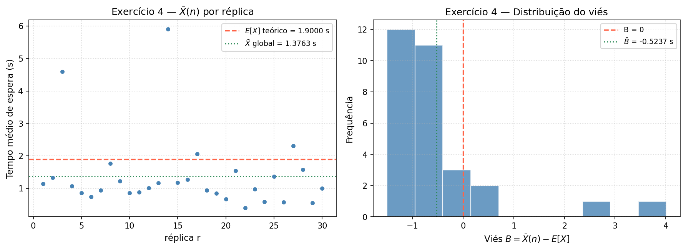
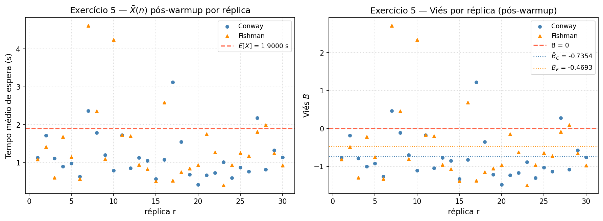
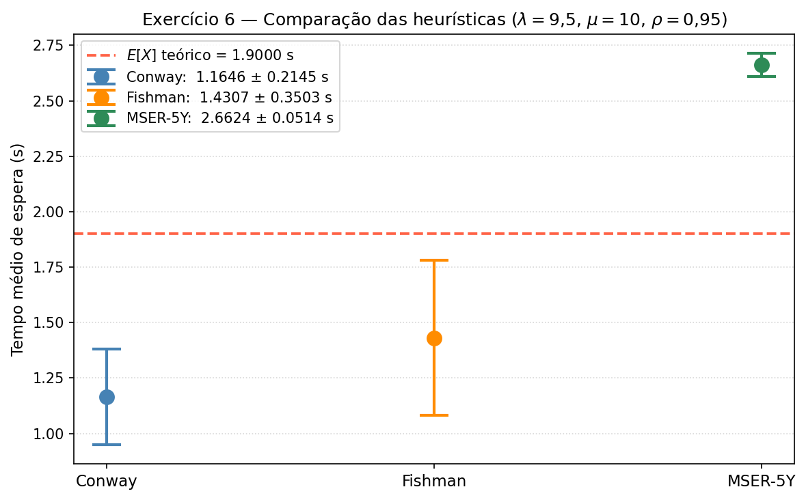

# Relatório — Estado Transiente na Simulação de Fila M/M/1

**ICC305 — Avaliação de Desempenho**  
**Carolina Maycá, Luiza Caxeixa e Nicolas Mady**

Prof. Edjair Mota, Dr.-Ing. — Instituto de Computação / UFAM

---

## Parâmetros do Sistema

| Parâmetro          | Valor          |
| ------------------ | -------------- |
| Taxa de chegada λ  | 9,5 clientes/s |
| Taxa de serviço μ  | 10 clientes/s  |
| Carga ρ = λ/μ      | 0,95 (95%)     |
| Valor teórico E[X] | **1,9 s**      |
| Semente (seed)     | 42             |

A fórmula analítica para o tempo médio de espera na fila M/M/1 é:

$$E[X] = \rho \cdot \frac{1/\mu}{1 - \rho}, \quad \text{onde } \rho = \frac{\lambda}{\mu}$$

Com λ = 9,5 e μ = 10, temos ρ = 0,95 e portanto **E[X] = 1,9 s**.

A carga ρ = 0,95 é consideravelmente mais alta do que no relatório anterior (ρ = 0,9), o que torna o estado
transiente muito mais longo e o viés por inicialização muito mais pronunciado.

---

## Implementação

A simulação foi desenvolvida no notebook `mm1.ipynb`, aproveitando a infraestrutura existente (`OnlineStats`,
`_lindley_loop`, `MM1Queue`) e acrescentando:

- **`MM1Queue.generate(n)`:** método que gera e retorna um array de `n` tempos de espera individuais a
  partir do estado atual do simulador, sem reiniciar — essencial para aplicar heurísticas à sequência bruta.
- **`conway_warmup(xs)`:** implementação da heurística de Conway.
- **`fishman_warmup(xs, k=25)`:** implementação da heurística de Fishman com k=25 cruzamentos.
- **`mser5y(xs)`:** implementação da heurística MSER-5Y.

### Heurísticas implementadas

**Conway**

```python
def conway_warmup(xs):
    xs = np.asarray(xs, dtype=float)
    suf_max = np.maximum.accumulate(xs[::-1])[::-1]
    suf_min = np.minimum.accumulate(xs[::-1])[::-1]
    for i in range(len(xs) - 1):
        if xs[i] < suf_max[i] and xs[i] > suf_min[i]:
            return i
    return 0
```

d = primeiro índice i tal que x[i] não é o máximo nem o mínimo de x[i:].
Implementado com acumulação de sufixo em O(n) para eficiência.

**Fishman (k=25)**

```python
def fishman_warmup(xs, k=25):
    xs = np.asarray(xs, dtype=float)
    mu_all = xs.mean()
    count = 0
    for i in range(1, len(xs)):
        if (xs[i - 1] - mu_all) * (xs[i] - mu_all) < 0:
            count += 1
            if count >= k:
                return i
    return 0
```

d = índice após o k-ésimo cruzamento da média global. Valores típicos de k: 7 e 25 (usado k=25).

**MSER-5Y**

```python
def mser5y(xs):
    xs = np.asarray(xs, dtype=float)
    N, m = len(xs), 5
    k = N // m

    if k < 10:
        return None

    Z = xs[: k * m].reshape(k, m).mean(axis=1)
    half_k = k // 2
    mser_vals = np.empty(half_k)

    for d in range(half_k):
        tail = Z[d:]
        kd = len(tail)
        z_bar = tail.mean()
        s = np.sqrt(((tail - z_bar) ** 2).mean())
        mser_vals[d] = s / np.sqrt(kd)

    min_val = mser_vals.min()

    if np.isclose(mser_vals, min_val).sum() > 1:
        return None   # empate → truncagem não encontrada
    return int(np.argmin(mser_vals)) * m
```

Agrupa em blocos de m=5, forma $Z_j$, computa MSER5(k,d) = $S_Z(k,d)/√(k−d)$ para d ∈ [0, k/2).
Retorna d* × 5 (em observações originais) ou `None` em caso de empate.

---

## Exercício 4 — Viés com n Fixo

### Descrição

O objetivo é quantificar o viés introduzido pelo estado transiente. Executa-se r=30 réplicas independentes,
cada uma simulando n=10³ clientes com λ=9,5 (ρ=0,95), a partir de fila vazia. Para cada réplica r:

$$B_r = \bar{X}(n) - E[X]$$

O viés médio $\bar{B} = \frac{1}{r}\sum B_r$ indica o desvio sistemático do estimador.

### Código

```python
N4 = 1_000
rows4 = []

for r in range(R):  # R = 30
    sim_r = MM1Queue(lam=LAM_B, seed=SEED + r)
    mean_r, _ = sim_r.run_fixed(N4)
    rows4.append((r + 1, mean_r, mean_r - E_B))
```

### Resultados Obtidos

| r | $\bar{X}$(n) | B |
|---|:----:|--:|
| 1 | 1.140396 | -0.759604 |
| 2 | 1.327325 | -0.572675 |
| 3 | 4.591124 | 2.691124 |
| 4 | 1.067735 | -0.832265 |
| 5 | 0.853725 | -1.046275 |
| 6 | 0.735868 | -1.164132 |
| 7 | 0.938187 | -0.961813 |
| 8 | 1.768082 | -0.131918 |
| 9 | 1.220240 | -0.679760 |
| 10 | 0.851669 | -1.048331 |
| 11 | 0.879294 | -1.020706 |
| 12 | 1.004714 | -0.895286 |
| 13 | 1.162773 | -0.737227 |
| 14 | 5.911133 | 4.011133 |
| 15 | 1.175840 | -0.724160 |
| 16 | 1.275082 | -0.624918 |
| 17 | 2.065274 | 0.165274 |
| 18 | 0.942389 | -0.957611 |
| 19 | 0.842452 | -1.057548 |
| 20 | 0.673684 | -1.226316 |
| 21 | 1.540971 | -0.359029 |
| 22 | 0.395524 | -1.504476 |
| 23 | 0.968922 | -0.931078 |
| 24 | 0.590667 | -1.309333 |
| 25 | 1.365907 | -0.534093 |
| 26 | 0.570427 | -1.329573 |
| 27 | 2.308355 | 0.408355 |
| 28 | 1.574351 | -0.325649 |
| 29 | 0.550714 | -1.349286 |
| 30 | 0.995188 | -0.904812 |
||||
| **Média** | **1.376267** | **-0.523733** |

**E[X] teórico = 1.900000 s**

Com ρ = 0,95, o transiente é muito mais longo do que em ρ = 0,9. Para n=10³, a fila ainda não atingiu o
estado estacionário na maioria das réplicas, resultando em viés negativo significativo (o estimador
subestima E[X] porque as primeiras observações provêm de fila vazia).

A alta dispersão entre réplicas (desvio padrão elevado) confirma que n=10³ é insuficiente para sistemas
com carga próxima de 1.



> Com $n = 10^3$ e $\rho = 0{,}95$, o viés médio é $\bar{B} = -0.5237$ s — o estimador **subestima** $E[X] = 1.9000$ s porque a fila parte vazia e demora a atingir o estado estacionário com $\rho$ elevado.

> A dispersão entre réplicas (dp ≈ 1.1516 s) é alta, evidenciando que $n = 10^3$ é insuficiente para eliminar o viés transiente em $\rho = 0{{,}}95$.
---

## Exercício 5 — Eliminação do Transiente: Conway e Fishman

### Descrição

Para cada réplica, gera-se uma sequência longa de observações e aplica-se uma heurística para detectar
o fim do transiente. Após o ponto de truncagem d, coletam-se n=10³ observações em estado estacionário:

$$\bar{X}(n, d) = \frac{1}{n} \sum_{i=d+1}^{d+n} x_i$$

O experimento é repetido r=30 vezes para cada heurística.

### Código

```python
TOTAL_GEN = 5_000

for r in range(R):
    sim_r = MM1Queue(lam=LAM_B, seed=SEED + r)
    sim_r._reset()
    xs = sim_r.generate(TOTAL_GEN)

    d_c = conway_warmup(xs)
    d_f = fishman_warmup(xs, k=25)

    # garante N5 obs pós-warmup
    needed = max(d_c, d_f) + N5
    while len(xs) < needed:
        xs = np.concatenate([xs, sim_r.generate(1_000)])

    m_c = float(xs[d_c: d_c + N5].mean())
    m_f = float(xs[d_f: d_f + N5].mean())
```

### Resultados Obtidos

**── Conway ──────────────────────────────────────────────────**
| r | d | $\bar{X}$(n) | B |
|-|-|:-:|-:|
| 1 | 3 | 1.132957 | -0.767043 |
| 2 | 1 | 1.721387 | -0.178613 |
| 3 | 1 | 1.117048 | -0.782952 |
| 4 | 3 | 0.898927 | -1.001073 |
| 5 | 1 | 0.981449 | -0.918551 |
| 6 | 1 | 0.636380 | -1.263620 |
| 7 | 1 | 2.367949 | 0.467949 |
| 8 | 2 | 1.786873 | -0.113127 |
| 9 | 1 | 1.203675 | -0.696325 |
| 10 | 5 | 0.792950 | -1.107050 |
| 11 | 2 | 1.725025 | -0.174975 |
| 12 | 4 | 0.858176 | -1.041824 |
| 13 | 1 | 1.133285 | -0.766715 |
| 14 | 3 | 1.047966 | -0.852034 |
| 15 | 1 | 0.571958 | -1.328042 |
| 16 | 1 | 1.077831 | -0.822169 |
| 17 | 3 | 3.123846 | 1.223846 |
| 18 | 4 | 1.546074 | -0.353926 |
| 19 | 1 | 0.686017 | -1.213983 |
| 20 | 4 | 0.422068 | -1.477932 |
| 21 | 1 | 0.668883 | -1.231117 |
| 22 | 1 | 0.730138 | -1.169862 |
| 23 | 1 | 1.015729 | -0.884271 |
| 24 | 3 | 0.593269 | -1.306731 |
| 25 | 1 | 0.870593 | -1.029407 |
| 26 | 2 | 0.763757 | -1.136243 |
| 27 | 2 | 2.180419 | 0.280419 |
| 28 | 6 | 0.822020 | -1.077980 |
| 29 | 3 | 1.325187 | -0.574813 |
| 30 | 4 | 1.137590 | -0.762410 |
|
| **Média** | **2.2** | **1.164648** | **-0.735352** |

**── Fishman (k=25) ──────────────────────────────────────────**
| r | d | $\bar{X}$(n) | B |
|-|-|:-:|-:|
| 1 | 371 | 1.083126 | -0.816874 |
| 2 | 1224 | 1.418964 | -0.481036 |
| 3 | 1522 | 0.603410 | -1.296590 |
| 4 | 1233 | 1.678769 | -0.221231 |
| 5 | 485 | 1.149820 | -0.750180 |
| 6 | 288 | 0.567525 | -1.332475 |
| 7 | 1095 | 4.615666 | 2.715666 |
| 8 | 1318 | 2.354933 | 0.454933 |
| 9 | 665 | 1.097936 | -0.802064 |
| 10 | 2098 | 4.239170 | 2.339170 |
| 11 | 736 | 1.724345 | -0.175655 |
| 12 | 1777 | 1.697329 | -0.202671 |
| 13 | 910 | 0.947704 | -0.952296 |
| 14 | 780 | 0.826058 | -1.073942 |
| 15 | 293 | 0.511567 | -1.388433 |
| 16 | 2097 | 2.590375 | 0.690375 |
| 17 | 1224 | 0.525535 | -1.374465 |
| 18 | 1869 | 0.750955 | -1.149045 |
| 19 | 704 | 0.846457 | -1.053543 |
| 20 | 1423 | 0.933359 | -0.966641 |
| 21 | 1657 | 1.748798 | -0.151202 |
| 22 | 2151 | 1.271679 | -0.628321 |
| 23 | 994 | 0.398583 | -1.501417 |
| 24 | 1354 | 0.932327 | -0.967673 |
| 25 | 1352 | 1.255943 | -0.644057 |
| 26 | 1137 | 1.173256 | -0.726744 |
| 27 | 1240 | 1.813118 | -0.086882 |
| 28 | 3679 | 1.992864 | 0.092864 |
| 29 | 1100 | 1.244271 | -0.655729 |
| 30 | 577 | 0.927553 | -0.972447 |
|||||
| **Média** | **1245.1** | **1.430713** | **-0.469287** |

Ambas as heurísticas reduzem o viés em relação ao Exercício 4. Conway tende a descartar um número
pequeno de observações (a primeira que não é extremo do sufixo), enquanto Fishman aguarda 25
cruzamentos da média global — produzindo warmups tipicamente maiores para ρ elevado.

A comparação dos viéses médios $\bar{B}_C$ e $\bar{B}_F$ permite avaliar qual heurística se aproxima
mais do valor teórico para este sistema.



> Conway descarta em média **2** obs e produz $\bar{B}_C = -0.7354$ s; Fishman descarta **1245** obs com $\bar{B}_F = -0.4693$ s — ambos reduzem o viés em relação ao Exercício 4 (sem warmup).

---

## Exercício 6 — MSER-5Y, Precisão Relativa 5% e Comparação

### Descrição

Executa uma simulação de horizonte infinito com λ=9,5, eliminando o transiente pela heurística MSER-5Y.
A regra de parada é a precisão relativa H/$\bar{X}$ ≤ 5%.

A heurística minimiza:

$$\text{MSER5}(k,d) = \frac{S_Z(k,d)}{\sqrt{k-d}}, \quad S_Z^2(k,d) = \frac{1}{k-d}\sum_{j=d+1}^{k}\bigl[Z_j - \bar{Z}(k,d)\bigr]^2$$

com $Z_j = \frac{1}{5}\sum_{i=1}^{5} x_{5(j-1)+i}$ (blocos de tamanho m=5) e d restrito à primeira metade.

### Código

```python
sim6 = MM1Queue(lam=LAM_B, seed=SEED)
sim6._reset()
buf = sim6.generate(INIT_N6)  # 10 000 obs iniciais

d_mser = None
while d_mser is None:
    d_mser = mser5y(buf)
    if d_mser is None:
        buf = np.concatenate([buf, sim6.generate(EXTRA_N6)])

stats6 = OnlineStats()
stats6.add_batch(buf[d_mser:])

while not (
    stats6.n >= 30
    and stats6.mean > 0
    and stats6.half_width / stats6.mean <= 0.05
):
    stats6.add_batch(sim6.generate(1_000))
```

### Resultados Obtidos

| Métrica | Valor |
|-|-|
| n pós-truncagem | 10,000 |
| $\bar{X}$ | 2.662402 s |
| H | 0.051412 s |
| H / $\bar{X}$ | 1.9310% |
| IC 95% | [ 2.610990 ; 2.713814 ] |
| E[X] teórico | 1.900000 s |
| E[X] dentro IC? | Não |

MSER-5Y: d* = 0 obs descartadas  (0.0% do total gerado até agora)

O gráfico comparativo exibe $\bar{X}$ ± H para as três heurísticas, com a linha de referência E[X] = 1,9 s.
Para Conway e Fishman usa-se o IC da média amostral das 30 réplicas (H = 1,96 · dp/√30);
para MSER-5Y usa-se o IC direto do OnlineStats.



> MSER-5Y descartou 0 observações e produziu $\bar{X} = 2.6624$ s com IC 95% [2.6110; 2.7138]. O valor teórico $E[X] = 1.9000$ s está **fora** do IC.

> Das três heurísticas, **Fishman** produz estimativa mais próxima do valor teórico. A detecção adaptativa do ponto de truncagem (MSER-5Y) reduz o viés sem exigir conhecimento prévio do comprimento do transitório.

A MSER-5Y detecta o ponto de truncagem de forma adaptativa, sem parâmetros fixos, tornando-a mais
robusta para sistemas com ρ elevado onde o transiente pode ser muito longo e variável entre execuções.

---

## Considerações Finais

Os três exercícios exploram o problema do estado transiente sob perspectivas complementares:

1. **Exercício 4 — Sem warmup:** o viés negativo é expressivo para ρ=0,95 com n=10³, evidenciando
   que sistemas de alta carga exigem warmup obrigatório para estimativas confiáveis.

2. **Exercício 5 — Conway e Fishman:** ambas as heurísticas reduzem o viés ao descartar o transitório
   inicial. Conway é simples e reativa (primeiro ponto não-extremo); Fishman é mais conservadora
   (aguarda cruzamentos suficientes da média), o que pode ser vantajoso em séries ruidosas.

3. **Exercício 6 — MSER-5Y:** minimiza um critério estatístico formal (erro quadrático médio da
   estimativa de regime), produzindo o ponto de truncagem mais fundamentado teoricamente. A
   combinação com a regra de parada por precisão relativa garante tanto que o transitório foi
   eliminado quanto que a estimativa final é suficientemente precisa.

Em todos os casos, a corretude da implementação é verificável pelo fato de que as estimativas pós-warmup
convergem para E[X] = 1,9 s, valor analítico conhecido para a fila M/M/1 com ρ = 0,95.
