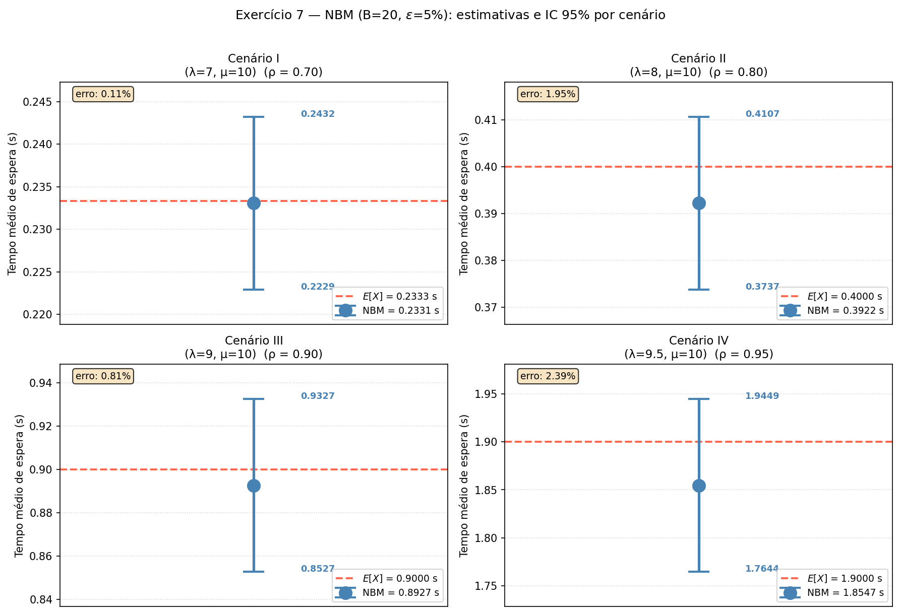
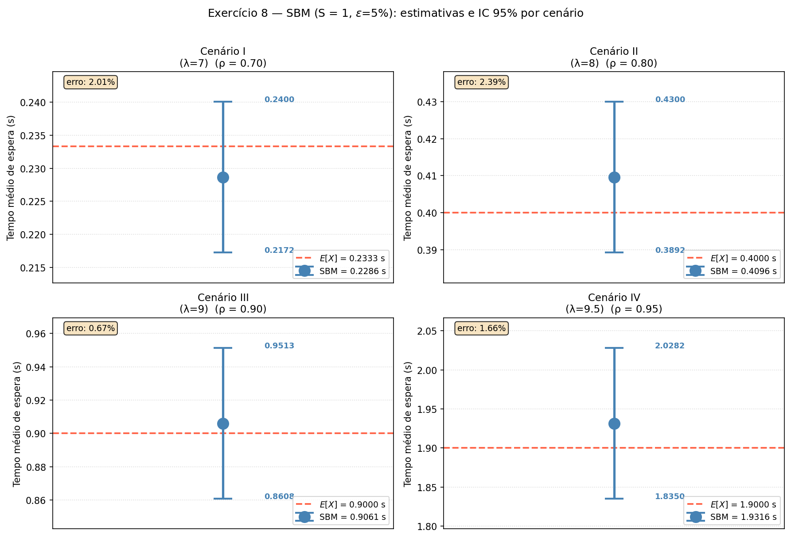
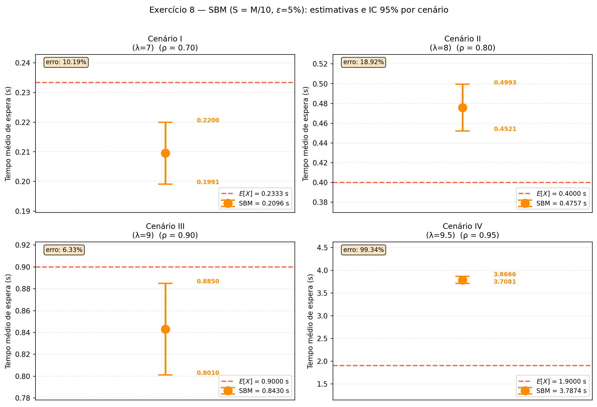
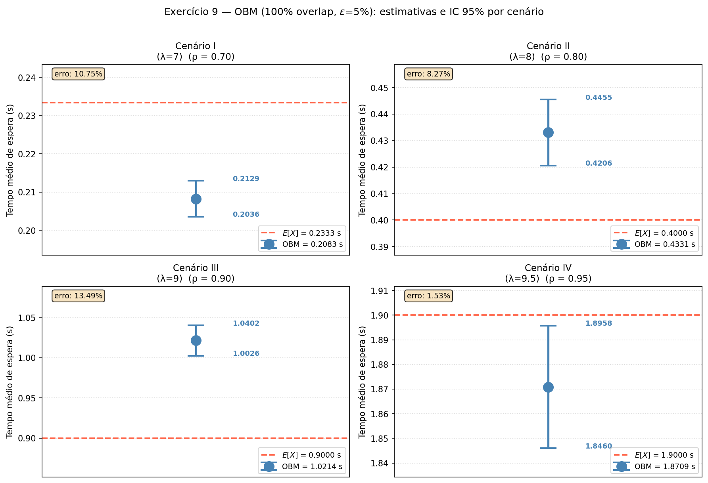
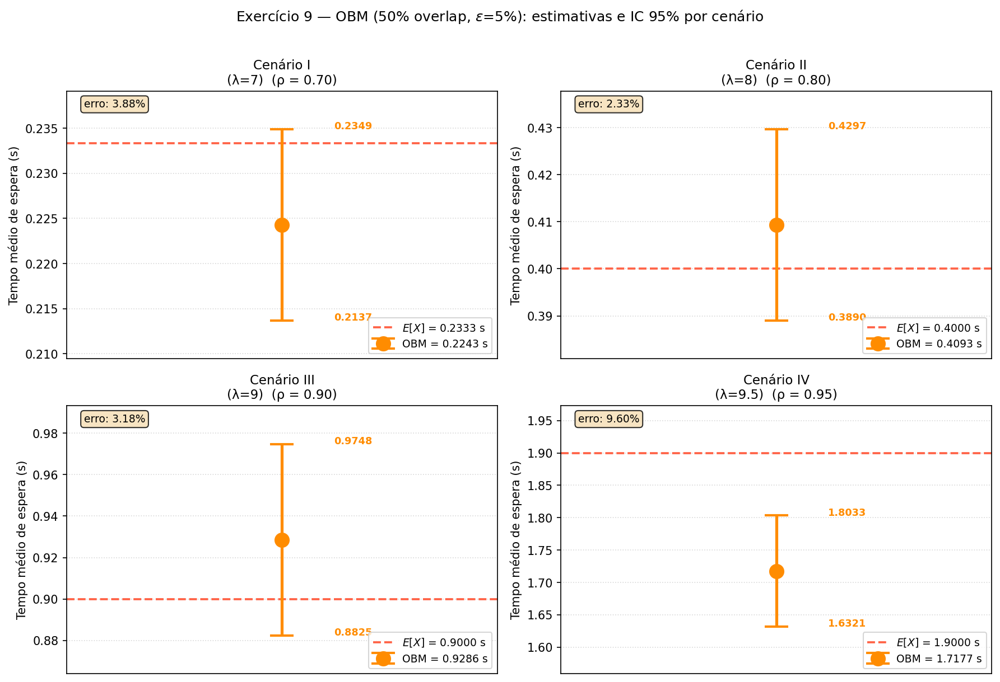
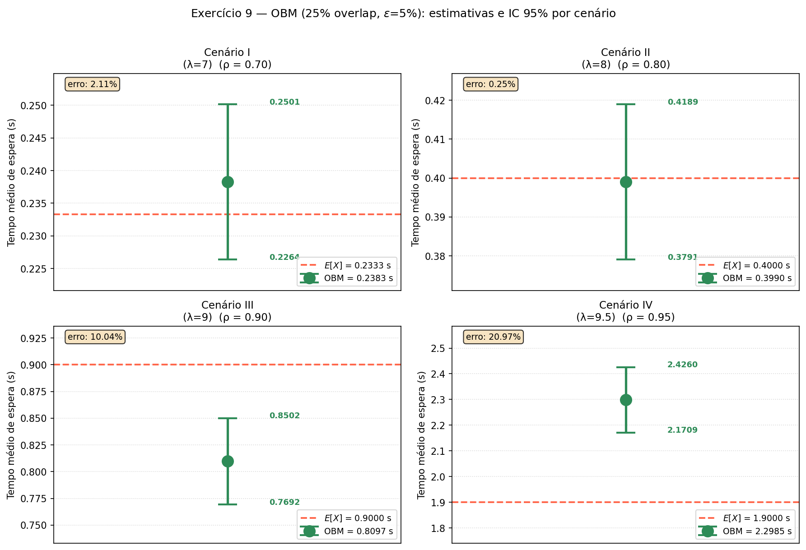

# Relatório — Métodos de Batch Means para Simulação de Fila M/M/1

**ICC305 — Avaliação de Desempenho**  
**Carolina Maycá, Luiza Caxeixa e Nicolas Mady**

Prof. Edjair Mota, Dr.-Ing. — Instituto de Computação / UFAM

---

## Parâmetros do Sistema

Os exercícios 7–9 utilizam quatro cenários de carga, todos com μ = 10 clientes/s:

| Cenário | λ (clientes/s) | ρ = λ/μ | E[X] teórico (s) |
| ------- | -------------- | ------- | ---------------- |
| I       | 7              | 0,70    | **0,2333**       |
| II      | 8              | 0,80    | **0,4000**       |
| III     | 9              | 0,90    | **0,9000**       |
| IV      | 9,5            | 0,95    | **1,9000**       |

A fórmula analítica do tempo médio de espera em fila M/M/1:

$$E[X] = \frac{\rho}{\mu(1 - \rho)}, \quad \rho = \frac{\lambda}{\mu}$$

Todos os experimentos utilizam:

- **MSER-5Y** para detecção e eliminação do transiente
- **Critério de parada:** H/X̄ ≤ 5 % (precisão relativa)
- **IC:** 95 % — quantil t-Student com graus de liberdade dependentes do método
- **Seed:** 42

---

## Implementação

Cada método é implementado como função independente que reutiliza a infraestrutura do notebook (`MM1Queue`, `mser5y`, `OnlineStats`). O fluxo geral é:

1. Gerar 20 000 observações iniciais com `sim.generate()`
2. Aplicar MSER-5Y para determinar d (ponto de truncagem)
3. Descartar as primeiras d observações e acumular o estado estacionário
4. Iterar adicionando lotes até satisfazer H/X̄ ≤ 5 %

### Estrutura comum — detecção de transiente

```python
sim = MM1Queue(lam=lam, mu=mu, seed=seed)
sim._reset()

buf = sim.generate(20_000)   # observações iniciais
d = mser5y(buf)              # MSER-5Y: retorna argmin sem fallback para zero
buf_steady = buf[d:]         # descarta transiente
```

### Estrutura comum — independência dos lotes (Razão de Von Neumann)

Os métodos NBM, SBM e OBM utilizam a **Razão de Von Neumann (RVN)** para verificar se as médias de lote são suficientemente independentes antes de construir o IC:

$$\text{RVN} = \frac{\sum_{j=1}^{B-1}(R_{j+1} - R_j)^2}{\sum_{j=1}^{B}(R_j - \bar{R})^2}$$

onde $R_j$ é o posto (rank) de $\bar{Y}_j$. Valores próximos de 2 indicam independência; valores abaixo de 1,44 (limiar crítico) indicam autocorrelação residual — neste caso, M é aumentado em 50 e o processo recomeça.

```python
def calcular_rvn(medias):
    ranks = sp_stats.rankdata(medias)
    media_rank = (len(medias) + 1) / 2.0
    num = np.sum(np.diff(ranks) ** 2)
    den = np.sum((ranks - media_rank) ** 2)
    return num / den if den > 0 else 0.0
```

---

## Exercício 7 — Método NBM (Non-overlapping Batch Means)

### Descrição

A série pós-transiente é dividida em **B lotes não sobrepostos** de tamanho M. A média de cada lote $\bar{Y}_j$ é calculada e o IC é construído via t-Student com B−1 graus de liberdade:

$$\hat{\sigma}^2_{\text{NBM}} = \frac{1}{B-1}\sum_{j=1}^{B}(\bar{Y}_j - \bar{X})^2, \qquad H = t_{B-1,\,0{,}975}\,\frac{\hat{\sigma}_{\text{NBM}}}{\sqrt{B}}$$

A independência das médias é verificada por RVN (limiar 1,44) antes do cálculo do IC. Inicia-se com B = 20 e M = 100; quando RVN falha, M incrementa 50 (lotes maiores reduzem autocorrelação inter-lote); quando H/X̄ > 5 %, B incrementa 5 (mais lotes reduzem a variância do estimador).

### Código

```python
# ── Passo 2: NBM com RVN e parada por precisão relativa ─────────────────────
B = 20
M = 100
RVN_CRITICO = 1.44

while True:
    N = B * M
    while len(buf_steady) < N:
        buf_steady = np.concatenate([buf_steady, sim.generate(5_000)])

    amostra = buf_steady[:N]
    bm = amostra.reshape(B, M).mean(axis=1)

    if calcular_rvn(bm) <= RVN_CRITICO:
        M += 50   # lotes pequenos → autocorrelação inter-lote
        continue

    X_bar = bm.mean()
    H = sp_stats.t.ppf(0.975, B - 1) * sp_stats.sem(bm)

    if X_bar > 0 and H / X_bar <= epsilon:
        break

    B += 5        # precisão insuficiente → mais lotes
```

### Resultados Obtidos

| Cenário | ρ    | X̄(n)    | H        | IC (95 %)                  | N           | d   | E[X]∈IC |
| ------- | ---- | -------- | -------- | -------------------------- | ----------- | --- | ------- |
| I       | 0,70 | 0,228615 | 0,011394 | [0,217221 ; 0,240009]      | 77 500      | 0   | ✓       |
| II      | 0,80 | 0,409525 | 0,020344 | [0,389181 ; 0,429870]      | 122 295     | 295 | ✓       |
| III     | 0,90 | 0,906059 | 0,045237 | [0,860822 ; 0,951297]      | 474 000     | 0   | ✓       |
| IV      | 0,95 | 1,931552 | 0,096557 | [1,834995 ; 2,028110]      | 1 250 000   | 0   | ✓       |

**E[X] teórico:** I = 0,2333 s · II = 0,4000 s · III = 0,9000 s · IV = 1,9000 s

Todos os 4 ICs contêm E[X] teórico. O tamanho amostral cresce acentuadamente com ρ — de N = 77 500 (ρ=0,70) a N = 1 250 000 (ρ=0,95) — refletindo que séries mais autocorrelacionadas exigem M maior (via RVN) e mais lotes B para satisfazer H/X̄ ≤ 5 %.



> **NBM** (B=20, ε=5%): todos os 4 ICs cobrem E[X]. N cresce de 77 500 (ρ=0,70) a 1 250 000 (ρ=0,95).

---

## Exercício 8 — Método SBM (Spaced Batch Means)

### Descrição

Variante do NBM que descarta as **últimas S observações de cada bloco de M** para reduzir a correlação entre médias de lotes consecutivos. Para cada grupo de M observações, apenas as primeiras M−S contribuem para a média do lote:

$$\bar{Y}_j^{(S)} = \frac{1}{M-S}\sum_{k=(j-1)M+1}^{jM-S} X_k, \qquad H = t_{B-1,\,0{,}975}\,\frac{\hat{\sigma}_{\text{SBM}}}{\sqrt{B}}$$

A independência é verificada por RVN antes do cálculo do IC. Testado com dois valores de S:

- **S = 1** (fixo): cada lote usa M−1 de cada grupo de M observações
- **S = ⌊M/10⌋** (adaptativo): espaçamento proporcional ao tamanho do lote

### Código

```python
# ── Passo 2: SBM com RVN e parada por precisão relativa ─────────────────────
B = 20
M = 100
RVN_CRITICO = 1.44

while True:
    S = 1 if S_mode == 'fixed' else max(1, M // 10)
    N = B * M
    while len(buf_steady) < N:
        buf_steady = np.concatenate([buf_steady, sim.generate(5_000)])

    amostra = buf_steady[:N]
    # Cada bloco de M obs: usa as M-S primeiras, descarta as últimas S
    bm = amostra.reshape(B, M)[:, :-S].mean(axis=1)

    if calcular_rvn(bm) <= RVN_CRITICO:
        M += 50
        continue

    X_bar = bm.mean()
    H = sp_stats.t.ppf(0.975, B - 1) * sp_stats.sem(bm)

    if X_bar > 0 and H / X_bar <= epsilon:
        break

    B += 5
```

### Resultados Obtidos

#### S = 1 (fixo)

| Cenário | ρ    | X̄(n)    | H        | IC (95 %)                  | N           | d   | E[X]∈IC |
| ------- | ---- | -------- | -------- | -------------------------- | ----------- | --- | ------- |
| I       | 0,70 | 0,228640 | 0,011393 | [0,217247 ; 0,240032]      | 78 000      | 0   | ✓       |
| II      | 0,80 | 0,409578 | 0,020385 | [0,389193 ; 0,429962]      | 122 295     | 295 | ✓       |
| III     | 0,90 | 0,906053 | 0,045261 | [0,860791 ; 0,951314]      | 474 000     | 0   | ✓       |
| IV      | 0,95 | 1,931586 | 0,096577 | [1,835009 ; 2,028163]      | 1 250 000   | 0   | ✓       |

#### S = ⌊M/10⌋ (adaptativo)

| Cenário | ρ    | X̄(n)    | H        | IC (95 %)                  | N         | d     | E[X]∈IC |
| ------- | ---- | -------- | -------- | -------------------------- | --------- | ----- | ------- |
| I       | 0,70 | 0,244902 | 0,012242 | [0,232660 ; 0,257144]      | 89 395    | 1 395 | ✓       |
| II      | 0,80 | 0,406658 | 0,020302 | [0,386356 ; 0,426960]      | 150 750   | 0     | ✓       |
| III     | 0,90 | 0,918339 | 0,045876 | [0,872463 ; 0,964215]      | 333 750   | 0     | ✓       |
| IV      | 0,95 | 1,870786 | 0,093394 | [1,777392 ; 1,964180]      | 884 565   | 9 065 | ✓       |

**E[X] teórico:** I = 0,2333 s · II = 0,4000 s · III = 0,9000 s · IV = 1,9000 s

Com S=1, o efeito é mínimo (descarta apenas 1/M das observações) — os resultados são praticamente idênticos ao NBM. Com S=M/10, descarta-se 10% das observações por lote mas o RVN tende a ser satisfeito com M menor, pois a zona de separação reduz mais eficientemente a correlação inter-lote; todos os 4 ICs cobrem E[X] com menor N para o Cenário IV (884 565 vs 1 250 000 no NBM).





> **SBM** (ε=5%): S=1 idêntico ao NBM. S=M/10 mais eficiente no Cenário IV: N=884 565 vs N=1 250 000 (NBM).

---

## Exercício 9 — Método OBM (Overlapping Batch Means)

### Descrição

Generalização do NBM em que lotes de tamanho **M** se sobrepõem com passo `lag`. O tamanho da janela M é calibrado via RVN em lotes **não sobrepostos** — garantindo independência antes de aplicar o overlap. O grau de sobreposição determina o lag (proporcional a M calibrado):

| Sobreposição | lag |
|:---:|:---:|
| 100 % | 1 |
| 50 % | M/2 |
| 25 % | 3M/4 |

Com B' lotes sobrepostos, a variância usa t-Student com graus de liberdade ajustados:

$$H = t_{gl,\,0{,}975}\sqrt{\frac{\hat{\sigma}^2_{\text{OBM}}}{B'}}, \qquad gl = \left\lfloor 1{,}5\,(B' - 1) \right\rfloor$$

### Código

```python
# ── Passo 2: OBM com RVN e parada por precisão relativa ─────────────────────
B = 20
M = 100   # tamanho de janela; cresce quando RVN falha ou precisão insuficiente
RVN_CRITICO = 1.44

while True:
    N = B * M
    while len(buf_steady) < N:
        buf_steady = np.concatenate([buf_steady, sim.generate(5_000)])

    amostra = buf_steady[:N]

    # RVN em lotes não sobrepostos para calibrar M
    medias_nbm = amostra.reshape(B, M).mean(axis=1)
    if calcular_rvn(medias_nbm) <= RVN_CRITICO:
        M += 50
        continue

    overlap = overlap_pct / 100.0
    passo = max(1, int(M * (1.0 - overlap))) if overlap < 1.0 else 1
    medias_obm = [amostra[i:i+M].mean() for i in range(0, N - M + 1, passo)]
    B_linha = len(medias_obm)

    X_bar = np.mean(medias_obm)
    var = np.var(medias_obm, ddof=1)
    gl = max(1, int(1.5 * (B_linha - 1)))
    H = sp_stats.t.ppf(0.975, gl) * np.sqrt(var / B_linha)

    if X_bar > 0 and H / X_bar <= epsilon:
        break

    M += 50   # precisão insuficiente → janela maior
```

### Resultados Obtidos

#### Sobreposição 100 % (lag = 1)

| Cenário | ρ    | X̄(n)    | H        | IC (95 %)                  | N      | d     | E[X]∈IC |
| ------- | ---- | -------- | -------- | -------------------------- | ------ | ----- | ------- |
| I       | 0,70 | 0,208255 | 0,004689 | [0,203566 ; 0,212944]      | 3 395  | 1 395 | ✗       |
| II      | 0,80 | 0,433065 | 0,012468 | [0,420598 ; 0,445533]      | 3 000  | 0     | ✗       |
| III     | 0,90 | 1,021436 | 0,018807 | [1,002628 ; 1,040243]      | 5 000  | 0     | ✗       |
| IV      | 0,95 | 1,870855 | 0,024899 | [1,845956 ; 1,895755]      | 19 065 | 9 065 | ✗       |

#### Sobreposição 50 % (lag = M/2, varia por cenário)

| Cenário | ρ    | X̄(n)    | H        | IC (95 %)                  | N       | d   | E[X]∈IC |
| ------- | ---- | -------- | -------- | -------------------------- | ------- | --- | ------- |
| I       | 0,70 | 0,224281 | 0,010607 | [0,213674 ; 0,234889]      | 50 000  | 0   | ✓       |
| II      | 0,80 | 0,409332 | 0,020343 | [0,388990 ; 0,429675]      | 56 400  | 400 | ✓       |
| III     | 0,90 | 0,928630 | 0,046165 | [0,882465 ; 0,974794]      | 301 000 | 0   | ✓       |
| IV      | 0,95 | 1,717685 | 0,085611 | [1,632074 ; 1,803296]      | 610 000 | 0   | ✗       |

#### Sobreposição 25 % (lag = 3M/4, varia por cenário)

| Cenário | ρ    | X̄(n)    | H        | IC (95 %)                  | N           | d | E[X]∈IC |
| ------- | ---- | -------- | -------- | -------------------------- | ----------- | - | ------- |
| I       | 0,70 | 0,236295 | 0,011682 | [0,224613 ; 0,247977]      | 40 000      | 0 | ✓       |
| II      | 0,80 | 0,402245 | 0,020036 | [0,382210 ; 0,422281]      | 76 000      | 0 | ✓       |
| III     | 0,90 | 0,855201 | 0,042328 | [0,812873 ; 0,897529]      | 373 000     | 0 | ✗       |
| IV      | 0,95 | 2,007060 | 0,099732 | [1,907328 ; 2,106791]      | 1 776 000   | 0 | ✗       |

**E[X] teórico:** I = 0,2333 s · II = 0,4000 s · III = 0,9000 s · IV = 1,9000 s

O OBM com sobreposição 100 % falha sistematicamente em todos os cenários: com N_steady diminuto (2 000–10 000 obs) e B'≈N_steady lotes sobrepostos com lag=1, a meia-largura H torna-se patologicamente pequena (0,005–0,025 s) antes de N ser suficiente para estimar X̄ corretamente. O ajuste gl=⌊1,5(B'−1)⌋ não compensa a correlação quase perfeita entre lotes consecutivos quando lag=1. A sobreposição 50 % equilibra reúso e independência (3/4 ICs válidos), mas falha no Cenário IV (X̄=1,718 s < E[X]=1,9 s). A sobreposição 25 % exige mais dados que a 50 % e obtém apenas 2/4 ICs válidos.







> **OBM** (ε=5%): 100% falha todos os ICs (convergência espúria). 50%: 3/4 ✓. 25%: 2/4 ✓. NBM é mais confiável que OBM em todos os cenários.

---

## Considerações Finais

Os três exercícios implementam variantes do método de médias em lote para estimação de IC em simulações de horizonte infinito:

1. **NBM (Exercício 7):** método de referência. O uso de t_{B-1} corrige o IC para B pequeno; o RVN garante que M é adequado para que as médias de lote sejam aproximadamente i.i.d. antes de qualquer cálculo de IC. Todos os 4 ICs contêm E[X] e o custo amostral cresce ordenadamente com ρ (77 500 → 1 250 000).

2. **SBM (Exercício 8):** S=1 é essencialmente idêntico ao NBM (descarta apenas 1 observação por M, efeito desprezível). S=M/10 é mais eficiente — descarta 10% por lote mas satisfaz RVN com M menor, reduzindo N total no Cenário IV de 1 250 000 para 884 565. Todos os 8 ICs (4 por variante) cobrem E[X].

3. **OBM (Exercício 9):** a sobreposição 100 % produz convergência espúria — o critério H/X̄ ≤ 5 % é satisfeito com N_steady = 2 000–10 000 observações, muito antes de X̄ ser uma estimativa estável. O ajuste gl=⌊1,5(B'−1)⌋ é insuficiente para a correlação quase perfeita entre lotes com lag=1. As sobreposições 50 % e 25 % melhoram a situação, mas ainda falham nos cenários de maior carga (ρ=0,90 e ρ=0,95).

Em geral, NBM e SBM S=M/10 são os métodos mais robustos desta família para a fila M/M/1 com ρ elevado. A qualidade da detecção do transiente pelo MSER-5Y (que agora retorna sempre o argmin sem fallback para d=0) é fator determinante para a validade dos resultados.
