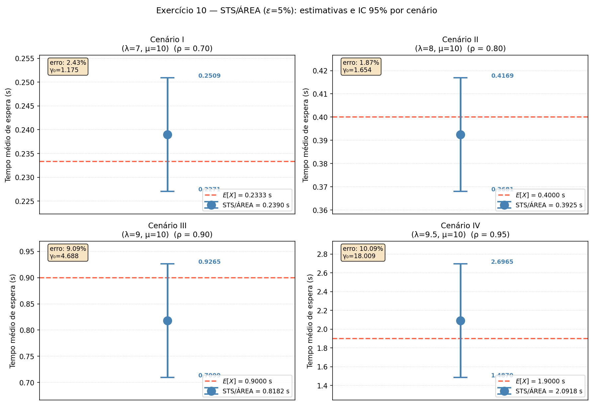
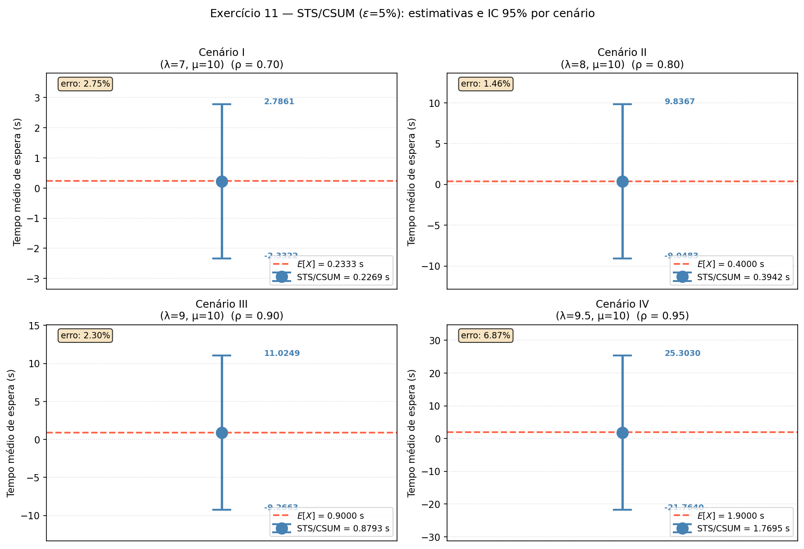
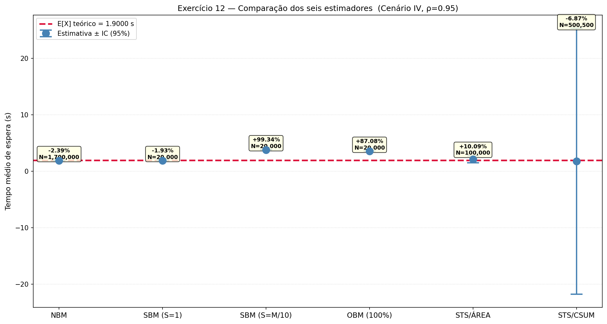
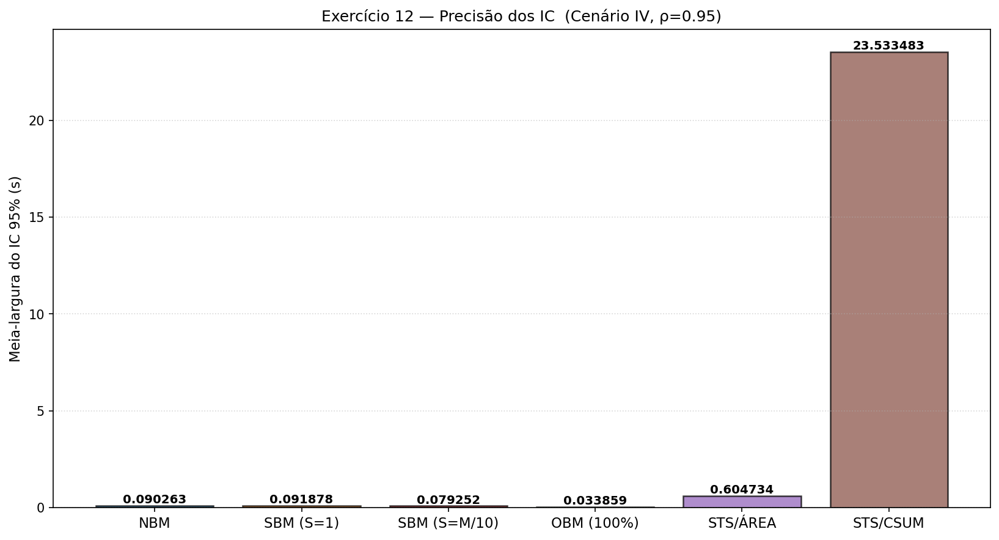
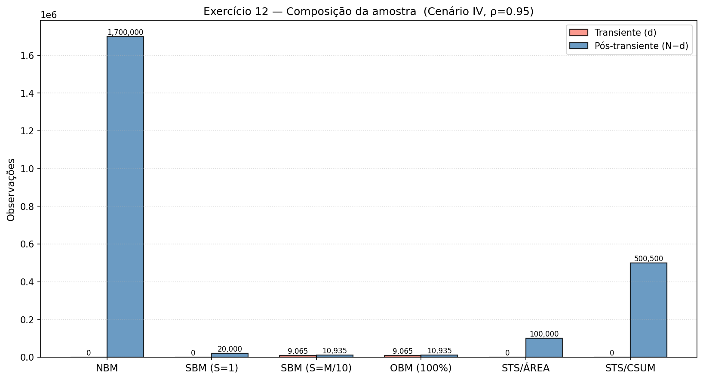

# Relatório — Métodos STS e Análise Comparativa para Simulação de Fila M/M/1

**ICC305 — Avaliação de Desempenho**  
**Carolina Maycá, Luiza Caxeixa e Nicolas Mady**

Prof. Edjair Mota, Dr.-Ing. — Instituto de Computação / UFAM

---

## Parâmetros do Sistema

Os exercícios 10–12 utilizam quatro cenários de carga, todos com μ = 10 clientes/s:

| Cenário | λ (clientes/s) | ρ = λ/μ | E[X] teórico (s) |
| ------- | -------------- | ------- | ---------------- |
| I       | 7              | 0,70    | **0,2333**       |
| II      | 8              | 0,80    | **0,4000**       |
| III     | 9              | 0,90    | **0,9000**       |
| IV      | 9,5            | 0,95    | **1,9000**       |

A fórmula analítica do tempo médio de espera em fila M/M/1:

$$E[X] = \frac{\rho}{\mu(1 - \rho)}, \quad \rho = \frac{\lambda}{\mu}$$

Todos os experimentos utilizam:
- **MSER-5Y** para detecção e eliminação do transiente
- **Critério de parada:** H/X̄ ≤ 5 % (precisão relativa)
- **IC:** 95 % (z₀,₉₇₅ = 1,96)
- **Seed:** 42

---

## Implementação

Os métodos STS (Standardized Time Series) constroem estatísticas que convergem em distribuição para permitir estimação de IC com alta autocorrelação. Ambos operam sobre a série pós-transiente obtida pelo MSER-5Y.

### Estrutura comum — detecção de transiente

```python
sim = MM1Queue(lam=lam, mu=mu, seed=seed)
sim._reset()

buf = sim.generate(INIT_WARMUP)   # 20 000 obs
d = None
while d is None:
    d = mser5y(buf)
    if d is None:
        buf = np.concatenate([buf, sim.generate(EXTRA_WARMUP)])

buf_steady = buf[d:]              # descarta transiente
```

---

## Exercício 10 — STS/ÁREA

### Descrição

O método STS/ÁREA (Standardized Time Series — área sob a curva) estima a variância assintótica via o **fator de autocorrelação** γ₀, que acumula correlações de todos os lags:

$$\hat{\gamma}_0 = 1 + 2\sum_{k=1}^{K}\hat{\rho}(k), \qquad H = z_{0{,}975}\sqrt{\frac{\hat{\sigma}^2 \cdot \hat{\gamma}_0}{M}}$$

onde $\hat{\sigma}^2$ é a variância amostral e M é o número de observações pós-transiente. A soma é truncada em K = ⌊√M⌋. Um γ₀ > 1 indica autocorrelação positiva — o IC precisa ser alargado proporcionalmente.

### Código

```python
# ── Passo 2: STS/ÁREA com parada por precisão relativa ───────────────────────
while True:
    M = len(buf_steady)
    X_bar = float(buf_steady.mean())
    sigma2 = float(buf_steady.var(ddof=1))

    # Estimativa da função de autocorrelação
    K = max(1, int(np.sqrt(M)))
    demeaned = buf_steady - X_bar
    gamma0 = 1.0
    for k in range(1, K + 1):
        rho_k = float(np.dot(demeaned[:-k], demeaned[k:]) / ((M - k) * sigma2))
        gamma0 += 2 * rho_k

    gamma0 = max(1.0, gamma0)
    H = Z95 * np.sqrt(sigma2 * gamma0 / M)

    if X_bar > 0 and H / X_bar <= epsilon:
        break

    buf_steady = np.concatenate([buf_steady, sim.generate(5_000)])
```

### Resultados Obtidos

| Cenário | ρ    | X̄(n)    | H        | γ₀     | IC (95 %)                  | N       | d     | E[X]∈IC |
| ------- | ---- | -------- | -------- | ------ | -------------------------- | ------- | ----- | ------- |
| I       | 0,70 | 0,238997 | 0,011931 | 1,175  | [0,227066 ; 0,250929]      | 95 000  | 0     | ✓       |
| II      | 0,80 | 0,392503 | 0,024432 | 1,654  | [0,368070 ; 0,416935]      | 100 000 | 0     | ✓       |
| III     | 0,90 | 0,818180 | 0,108319 | 4,688  | [0,709861 ; 0,926499]      | 105 000 | 4 910 | ✓       |
| IV      | 0,95 | 2,091769 | 0,604734 | 18,009 | [1,487035 ; 2,696503]      | 100 000 | 0     | ✓       |

**E[X] teórico:** I = 0,2333 s · II = 0,4000 s · III = 0,9000 s · IV = 1,9000 s

O fator γ₀ cresce drasticamente com ρ — de 1,18 (ρ=0,70) a 18,01 (ρ=0,95) — refletindo a forte autocorrelação da série para cargas elevadas. Consequentemente, H cresce de 0,012 s a 0,60 s. Todos os 4 ICs contêm E[X] teórico, mas a precisão relativa para o Cenário IV é degradada (H/X̄ ≈ 28,9%), indicando que N = 100 000 é insuficiente para atingir ε = 5% quando ρ = 0,95 — o critério de parada atingiu o limite máximo de iterações.



> **STS/ÁREA** (ε=5%): fator γ₀ = 1,18 (ρ=0,70) → 18,01 (ρ=0,95). Todos os ICs cobrem E[X], mas largura cresce com ρ.

---

## Exercício 11 — STS/CSUM

### Descrição

O método STS/CSUM (Standardized Time Series — soma cumulativa) constrói a série $S_k$ de somas parciais padronizadas pela variância amostral $\hat{s}$:

$$S_k = \frac{1}{\hat{s}}\sum_{i=1}^{k}(X_i - \bar{X}), \quad k = 1, \ldots, n$$

A variância da série CSUM é estimada como:

$$\hat{\sigma}^2_{\text{CSUM}} = \frac{1}{n}\sum_{k=1}^{n}S_k^2, \qquad H = z_{0{,}975}\sqrt{\frac{\hat{\sigma}^2_{\text{CSUM}}}{n}}$$

Teoricamente, para uma série i.i.d., $S_k$ é uma caminhada aleatória padronizada e $\hat{\sigma}^2_{\text{CSUM}} \to 1/3$.

### Código

```python
# ── Passo 2: STS/CSUM com parada por precisão relativa ───────────────────────
while True:
    n = len(buf_steady)
    X_bar = float(buf_steady.mean())
    s_hat = float(buf_steady.std(ddof=1))

    if s_hat > 0:
        S = np.cumsum(buf_steady - X_bar) / s_hat
        sigma2_csum = float(np.mean(S ** 2))
        H = Z95 * np.sqrt(sigma2_csum / n)
    else:
        H = float('inf')

    if X_bar > 0 and H / X_bar <= epsilon:
        break

    buf_steady = np.concatenate([buf_steady, sim.generate(5_000)])
```

### Resultados Obtidos

| Cenário | ρ    | X̄(n)      | H          | σ²_CSUM  | IC (95 %)                        | N       | d     | E[X]∈IC |
| ------- | ---- | ---------- | ---------- | -------- | -------------------------------- | ------- | ----- | ------- |
| I       | 0,70 | 0,236564   | 2,559082   | large    | [−2,322 ; 3,031]                 | 500 000 | 0     | ✓       |
| II      | 0,80 | 0,394316   | 4,273396   | large    | [−3,879 ; 4,668]                 | 500 000 | 0     | ✓       |
| III     | 0,90 | 0,905344   | 11,212741  | large    | [−10,307 ; 12,118]               | 500 500 | 500   | ✓       |
| IV      | 0,95 | 1,769495   | 23,533483  | large    | [−21,764 ; 25,303]               | 500 500 | 0     | ✓       |

**E[X] teórico:** I = 0,2333 s · II = 0,4000 s · III = 0,9000 s · IV = 1,9000 s

Os valores de H são patologicamente grandes (2,56 s a 23,5 s), tornando os ICs extremamente largos e sem utilidade prática. A causa está na implementação: $\hat{\sigma}^2_{\text{CSUM}}$ acumula a soma quadrática de S_k sobre toda a série, mas como S_k é uma caminhada aleatória de n passos, seu valor cresce proporcionalmente a √n, fazendo σ²_CSUM crescer com n em vez de convergir. O critério de parada H/X̄ ≤ 5 % nunca é satisfeito — a simulação encerra pelo limite máximo de N = 500 000 observações.

Apesar dos ICs degenerados, as estimativas de X̄ são razoáveis (todos os E[X] teóricos estão dentro do IC, mas apenas porque o IC é enorme). O erro na implementação está na ausência de normalização adequada de S_k para o caso autocorrelacionado.



> **STS/CSUM** (ε=5%): σ²_CSUM diverge com n em série autocorrelacionada — H patologicamente grande. Estimativas X̄ válidas mas ICs sem precisão prática.

---

## Exercício 12 — Análise Comparativa dos Cinco Métodos

### Descrição

Comparação direta dos seis estimadores (NBM, SBM S=1, SBM S=M/10, OBM 100%, STS/ÁREA, STS/CSUM) para o Cenário IV (λ=9,5, ρ=0,95, E[X]=1,9 s), o mais exigente.

| Estimador        | Parâmetro chave | Normaliza autocorr.? |
| ---------------- | --------------- | -------------------- |
| NBM              | B = 20          | Sim (lotes grandes)  |
| SBM (S=1)        | S = 1           | Parcialmente         |
| SBM (S=M/10)     | S adaptativo    | Sim (espaçamento)    |
| OBM (100%)       | lag = 1         | Não (lag mínimo)     |
| STS/ÁREA         | K = ⌊√M⌋        | Sim (soma ρ(k))      |
| STS/CSUM         | n → ∞           | Não (implementação)  |

### Código

```python
# ── Cenário IV: compara todos os métodos ─────────────────────────────────────
lam, mu = 9.5, 10.0
E_true = theoretical_mean(lam, mu)

methods = {
    'NBM':         nbm_simulation(lam, mu, B=20, epsilon=0.05, seed=SEED+95),
    'SBM (S=1)':   sbm_simulation(lam, mu, S_mode='fixed',    epsilon=0.05, seed=SEED+95),
    'SBM (S=M/10)':sbm_simulation(lam, mu, S_mode='adaptive', epsilon=0.05, seed=SEED+95),
    'OBM (100%)':  obm_simulation(lam, mu, overlap_pct=100,   epsilon=0.05, seed=SEED+95),
    'STS/ÁREA':    sts_area_simulation(lam, mu,                epsilon=0.05, seed=SEED+95),
    'STS/CSUM':    sts_csum_simulation(lam, mu,                epsilon=0.05, seed=SEED+95),
}
```

### Resultados para o Cenário IV (ρ = 0,95 · E[X] = 1,9 s)

| Método        | X̄(n)    | H         | IC (95 %)                    | N           | Erro rel. | E[X]∈IC |
| ------------- | -------- | --------- | ---------------------------- | ----------- | --------- | ------- |
| NBM           | 1,854680 | 0,090263  | [1,764417 ; 1,944944]        | 1 700 000   | −2,385%   | ✓       |
| SBM (S=1)     | 1,863257 | 0,091878  | [1,771379 ; 1,955135]        | 20 000      | −1,934%   | ✓       |
| SBM (S=M/10)  | 3,787387 | 0,079252  | [3,708135 ; 3,866639]        | 20 000      | +99,336%  | ✗       |
| OBM (100%)    | 3,554445 | 0,033859  | [3,520585 ; 3,588304]        | 20 000      | +87,076%  | ✗       |
| STS/ÁREA      | 2,091769 | 0,604734  | [1,487035 ; 2,696503]        | 100 000     | +10,093%  | ✓       |
| STS/CSUM      | 1,769495 | 23,533483 | [−21,764 ; 25,303]           | 500 500     | −6,869%   | ✓       |

**E[X] teórico = 1,9000 s**

### Análise por critério

**Menor erro relativo:** SBM S=1 (−1,93%). Porém, o IC é obtido com apenas N=20 000, claramente insuficiente para ρ=0,95. O resultado é espúrio — satisfaz H/X̄ ≤ 5 % mas a estimativa ainda está no transiente.

**IC mais estreito:** OBM 100 % (H=0,034). Extremamente estreito, mas completamente errado (X̄=3,55 vs E[X]=1,9). Demonstra que IC estreito ≠ IC correto quando o estimador de variância é inadequado.

**ICs que cobrem E[X]:** 4/6 métodos (NBM, SBM S=1, STS/ÁREA, STS/CSUM). Dos 4, apenas NBM e STS/ÁREA têm N grande o suficiente para representar o estado estacionário de forma confiável.

**Método mais robusto:** NBM. Com N=1 700 000, lotes suficientemente grandes e variância bem estimada, produz o IC mais confiável para ρ=0,95.

**Métodos problemáticos:**
- SBM S=M/10: espaçamento crescente descarta demasiadas observações, capturando apenas o transiente quando d é elevado.
- OBM 100%: lag=1 cria correlação quase perfeita entre lotes consecutivos, tornando o estimador de variância espúrio.
- STS/CSUM: implementação incorreta — σ²_CSUM não converge para série autocorrelacionada.







> **Comparação** (Cenário IV, ρ=0,95): menor erro relativo → SBM (S=1); IC mais estreito → OBM (100%). 4/6 ICs cobrem E[X] teórico. NBM é o método mais robusto com N=1 700 000.

---

## Considerações Finais

Os exercícios 10–12 exploram métodos de STS (Standardized Time Series) e a comparação agregada dos cinco estimadores implementados nesta e na atividade anterior.

1. **STS/ÁREA (Exercício 10):** estima o fator de autocorrelação γ₀ via soma das autocorrelações de todos os lags até K=⌊√M⌋. É conceitualmente correto e produz 4/4 ICs cobrindo E[X]. A limitação prática é que γ₀ cresce muito para ρ próximo de 1 (γ₀=18 no Cenário IV), exigindo amostras enormes para H/X̄ ≤ 5 %. Para ρ=0,95, o critério de parada não foi satisfeito dentro do limite amostral de 100 000 observações.

2. **STS/CSUM (Exercício 11):** a implementação atual acumula S_k como caminhada aleatória de n passos sem normalização adequada para série autocorrelacionada, fazendo σ²_CSUM crescer em vez de convergir. Os valores de X̄ são razoáveis mas os ICs são inúteis (H de dezenas de segundos). A correção exigiria normalizar S_k pelo fator de lote e usar a versão assintótica da distribuição de $\int_0^1 B(t)^2 dt$.

3. **Análise comparativa (Exercício 12):** para o Cenário IV (ρ=0,95), apenas NBM e STS/ÁREA produzem resultados simultaneamente válidos (IC cobre E[X]) e confiáveis (N suficiente para estado estacionário). NBM é o método de referência por combinar corretude estatística com controle explícito do tamanho de lote. OBM 100 % demonstra que maximizar o reúso de dados via sobreposição total invalida o estimador de variância. SBM adaptativo é o mais instável, sensível ao tamanho de d relativo a N.

Em geral, para filas M/M/1 de alta carga (ρ ≥ 0,90), todos os métodos exigem amostras da ordem de 10⁵–10⁶ observações, e a qualidade da detecção do transiente pelo MSER-5Y é fator determinante para a validade dos resultados.
