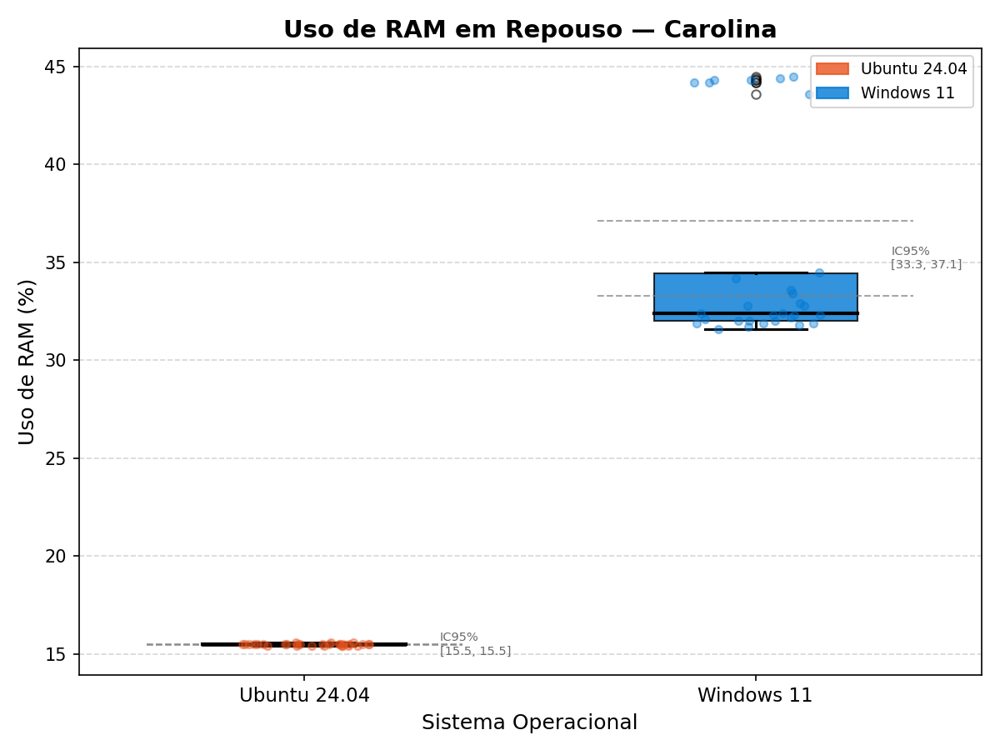

**ICC305 2026/01 — Avaliação de Desempenho**

# Mini Estudo 1: Baseline do Uso de RAM em Sistemas Operacionais

Carolina Falabelo Maycá
Luiza da Costa Caxeixa
Nicolas Mady Corrêa Gomes

---

## Contexto

- **Trilha:** Dispositivo Pessoal
- **Pergunta:** O sistema operacional influencia no uso da RAM?
- **Objetivo:** Estabelecer um baseline de consumo de RAM em Windows vs Linux (Ubuntu/Fedora)
- **Abordagem:** Medir o percentual de RAM utilizada após estabilização do sistema com uma carga padronizada

---

## Pergunta Operacional

> Qual é o percentual de uso de RAM em estado estável após a abertura de um conjunto padronizado de aplicações, em máquinas com diferentes sistemas operacionais?

- **Métrica principal:** % de RAM utilizada (`uso_percent`)
- **Instrumento:** Script Python com `psutil.virtual_memory().percent`
- **Medição:** Direta — o kernel reporta o uso real

---

## Protocolo de Coleta

1. Reinicializar a máquina
2. Aguardar estabilização do sistema
3. Executar o script: **30 medições × 20 segundos de intervalo**
4. Dados salvos em CSV + metadados em JSON

**Controles:**
- Mesmo conjunto de aplicações durante toda a coleta
- Mesmo modo de energia
- Mesmo script (`ram_monitor.py`) em todos os ambientes

---

## Ambientes de Coleta

| Operador | SO | RAM | Máquina | CPU (fís/lóg) |
|----------|:--:|:---:|:-------:|:-------------:|
| Carolina | Ubuntu 24.04 | 15,35 GB | carole | 10/12 |
| Carolina | Windows 11 | 15,73 GB | CaroleIII | 10/12 |
| Luiza | Ubuntu 24.04 | 7,50 GB | caxeixas | 4/8 |
| Luiza | Windows 11 | 7,84 GB | swift | 4/8 |
| Nicolas | Fedora 44 | 15,13 GB | fedora | 14/18 |
| Nicolas | Windows 11 | 15,53 GB | DESKTOP-25F8DM4 | 14/18 |

---

## Dados Coletados — Resumo Estatístico

| Cenário | Média (%) | Mediana | Desvio | Mín | Máx |
|---------|:---------:|:-------:|:------:|:---:|:---:|
| Ubuntu 16 GB (Carolina) | 15,48 | 15,5 | 0,06 | 15,4 | 15,6 |
| Windows 16 GB (Carolina) | 35,22 | 32,4 | 5,10 | 31,6 | 44,5 |
| Ubuntu 8 GB (Luiza) | 23,95 | 23,8 | 0,62 | 23,7 | 27,2 |
| Windows 8 GB (Luiza) | 64,89 | 63,6 | 4,44 | 59,8 | 81,8 |
| Fedora 16 GB (Nicolas) | 15,69 | 15,7 | 0,26 | 15,0 | 16,0 |
| Windows 16 GB (Nicolas) | 40,06 | 39,9 | 0,56 | 39,2 | 41,5 |

Coleta: 2026-05-09, 30 medições por cenário

---

## Intervalos de Confiança (95%)

| Cenário | IC 95% | Precisão Relativa |
|---------|:------:|:-----------------:|
| Ubuntu 16 GB (Carolina) | [15,46 ; 15,51] | 0,14% |
| Windows 16 GB (Carolina) | [33,31 ; 37,12] | 5,40% |
| Ubuntu 8 GB (Luiza) | [23,72 ; 24,18] | 0,96% |
| Windows 8 GB (Luiza) | [63,24 ; 66,55] | 2,55% |
| Fedora 16 GB (Nicolas) | [15,59 ; 15,78] | 0,59% |
| Windows 16 GB (Nicolas) | [39,86 ; 40,26] | 0,50% |

5 de 6 cenários com precisão < 3% — excelente

---

## Suficiência Amostral

| Cenário | n necessário (5%) | n coletado | Suficiente? |
|---------|:-----------------:|:----------:|:-----------:|
| Ubuntu 16 GB (Carolina) | 1 | 30 | Sim |
| Windows 16 GB (Carolina) | 36 | 30 | Marginal |
| Ubuntu 8 GB (Luiza) | 2 | 30 | Sim |
| Windows 8 GB (Luiza) | 8 | 30 | Sim |
| Fedora 16 GB (Nicolas) | 1 | 30 | Sim |
| Windows 16 GB (Nicolas) | 1 | 30 | Sim |

Windows 16 GB (Carolina) apresentou maior variabilidade por atividade do antivírus MsMpEng durante a coleta.

---

## Visualização — Visão Geral

---

## Visualização — Carolina (16 GB)

Ubuntu ~15,5% vs Windows ~35% — diferença de ~20 p.p.

---

## Visualização — Luiza (8 GB)

Ubuntu ~24% vs Windows ~65% — diferença de ~41 p.p.

Nota: TiWorker.exe (Windows Update) gerou pico de 81,8% nas medições 21–23

---

## Visualização — Nicolas (16 GB)

Fedora ~15,7% vs Windows ~40% — diferença de ~24 p.p.

---

## Visualização — Linux vs Windows (Agregado)

Linux: μ = 18,4% · Windows: μ = 46,7%

Teste t de Welch: t = −18,93, p = 1,70 × 10⁻³⁵, Cohen's d = −2,82 (efeito muito grande)

---

## Interpretação

- **16 GB (Carolina):** Ubuntu ~15,5% vs Windows ~35% — **~20 p.p.**
- **16 GB (Nicolas):** Fedora ~15,7% vs Windows ~40% — **~24 p.p.**
- **8 GB (Luiza):** Ubuntu ~24% vs Windows ~65% — **~41 p.p.**
- Ubuntu e Fedora se comportam de forma muito semelhante (~15,5–16%) em 16 GB
- Windows opera sob pressão de memória significativamente maior em todos os cenários

**Causa provável:** serviços nativos mais pesados no Windows (MsMpEng, explorer.exe, dwm.exe, TiWorker.exe, MemCompression)

---

## Limitações

1. Máquinas com hardware diferente entre operadores (CPUs, RAM)
2. Processos de fundo não equivalentes entre SOs
3. Carga de trabalho não representa todos os perfis de uso
4. Coletas Windows e Linux em instantes temporais diferentes
5. Overhead do próprio script de medição

---

## Conclusão

- **Windows consome significativamente mais RAM que Linux** nas condições testadas
- Diferença de 20–41 p.p. em todos os pares testados (t = −18,93, p = 1,70 × 10⁻³⁵)
- Protocolo estável: ICs estreitos em 5/6 cenários (precisão relativa < 3%)
- Limitação: RAM total reportada difere ~380 MB entre SOs na mesma máquina (mapeamento de firmware)
- Baseline estabelecido com sucesso para comparações futuras
